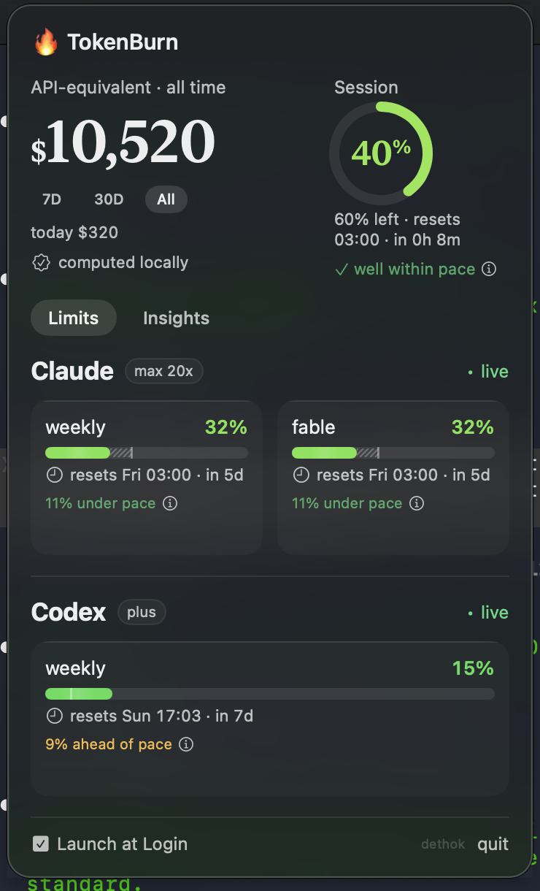
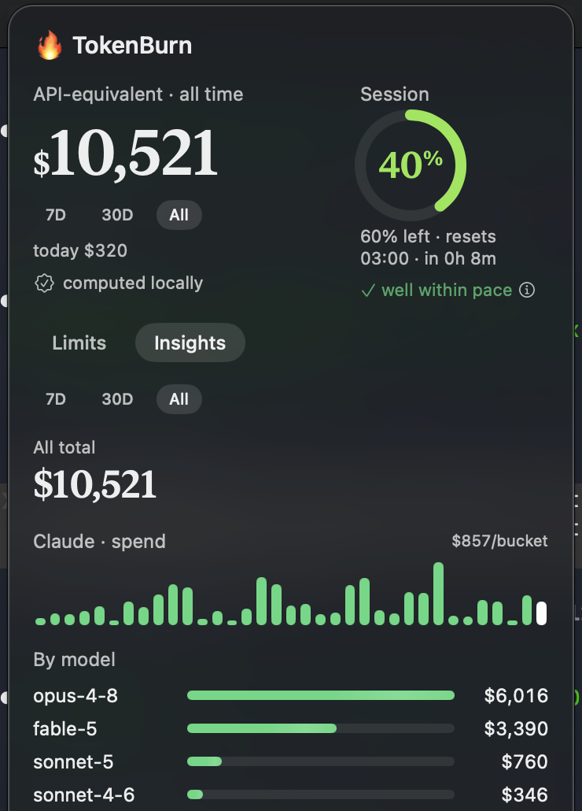

# 🔥 TokenBurn

A free, native macOS menu bar app for watching your Claude Code and Codex usage: live rate-limit gauges, a Liquid Glass popover, and a local, on-device API-equivalent cost audit of your own session logs.

## Install

```
git clone https://github.com/dethok/tokenburn.git
cd tokenburn
bash build.sh
```

This builds the app and installs it to `~/Applications/TokenBurn.app`. Launch it from Finder or `open ~/Applications/TokenBurn.app`.

A Homebrew tap is coming.

## Requirements

- macOS 26+ (uses the native Liquid Glass API — the app will not build or run on earlier macOS versions)
- Xcode Command Line Tools (`xcode-select --install`)
- An existing Claude Code login (for Claude usage data)
- Codex CLI login is optional, for Codex usage data

## Privacy

TokenBurn runs entirely on your machine. It talks only to `api.anthropic.com` and `chatgpt.com`, using your existing local Claude Code / Codex CLI logins — it never asks you to sign in separately. Cost calculations are computed locally by reading your own session logs (`~/.claude/projects/`, `~/.codex/sessions/`); nothing is uploaded anywhere. There is no telemetry, no analytics, and no third-party server in the loop.

TokenBurn uses the same undocumented usage endpoints the official Claude Code and Codex CLIs use internally. These aren't a published, stable API — they can change or break without notice.

## Screenshots

| Limits | Insights |
|---|---|
|  |  |
